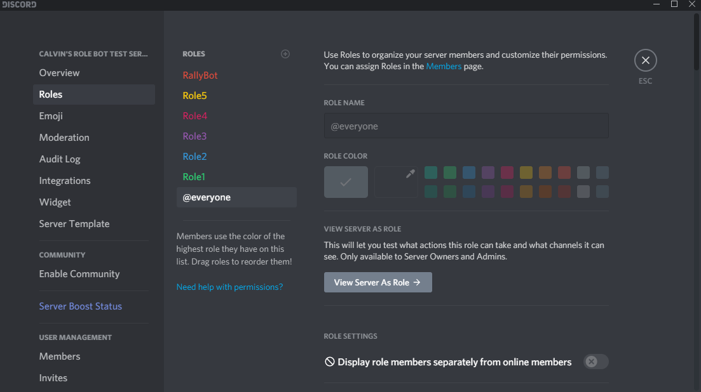

# RallyRoleBot 

A bot for managing roles based on Rally.io holdings

## Adding the bot to your server

Click this link to add the bot to your server [https://discord.com/api/oauth2/authorize?client_id=769334375023640578&permissions=268438560&scope=bot](https://discord.com/api/oauth2/authorize?client_id=769334375023640578&permissions=268438560&scope=bot)

Once the bot has been added to your server you need to ensure that it can access and change your roles and channels.

The role for the bot must be above any roles it is meant to manage.

The bot must also have permissions for any private channels it needs to manage.

To set role or channel mappings for the bot to manage you must have the administrator privilege on your server.

## Usage

Type `$help` to see a list of commands

## Development

This is a discord bot. To use it you must have a bot set up through
the discord developers portal.

Then simply install the requirements and run `python rallyrolebot/main.py --secret_token <your_secret_token>`

More specifically:

`python3 -m venv venv`

Linux/MacOS: `source venv/bin/activate`
Windows: `.\venv\Scripts\Activate.ps1`

`pip install -r requirements.txt`

`python rallyrolebot/main.py --secret_token <your_secret_token>`

If you run into a Privileged Intents Error, your bot must have the following options enabled

